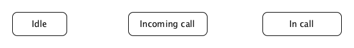
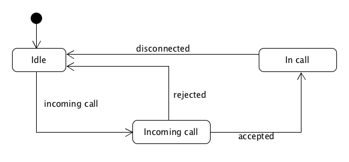

# Tutorial - Handling the states of a phone call

## Introduction
This tutorial will describe how to write a state machine that can deal with the various states and events of a phone call. It will be implemented using [Anno State Machine](https://github.com/MaxRingstrom/anno-state-machine).

## Starting with some known states
Let's start by just putting down some obvious states on "paper" so that we can start modelling the state machine. My goal is to be able to draw the state machine that we will later implement.

- Idle
- Incoming Call
- In Call



We have three states, but no information on how to move between them. We show which state to start the machine in and the signals that will be sent to the state machine in response to the following events:

- There's an incoming call
- The call is accepted
- The call is rejected
- The call is disconnected



1. The machine starts in the **Idle** state
2. It moves to the **Incoming call** state when there's an incoming call *if* it is currently in the **Idle state**. If there's an incoming call in any other state it will not result in a state transition.
3. When there's an incoming call the machine will go back to **Idle** if the call is rejected or to **In call** if it is accepted.
4. Once a call is in progress the machine can move to the **Idle** state if the call is disconnected for whatever reason.

Now, we've only covered a very limited amount of scenarios involved in phone call state handling. The state machine diagram makes it quite easy to see which events we handle and which we do not. For instance, what happens if the machine is in the **Incoming call** state and the caller stops calling? The machine will get stuck in the **Incoming call** state until some component magically sends the **rejected** signal.

By looking at the diagram we were able to quickly identify a missing part in our (my) design of the call handling code. There are a lot of missing pieces as you'll see throughout the tutorial.

The interesting thing to take note of here is how easy it is to look at the diagram and to start a discussion about how the code will work, which corner cases are covered and which are not. It's really easy to ask "What if *this* happens and then
that* happens" type questions.

Let's see how this state machine looks in [Anno State Machine](https://github.com/MaxRingstrom/anno-state-machine) syntax.

## The first call state handling state machine
```

```
